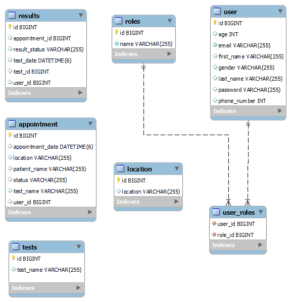

# diagno

## About
A completely automated laboratory management system helps to manage laboratory and patient appointments. The system has 3 roles
1. ADMIN
2. USER
3. LAB TECHNICIAN

Admin has bellow rights
- Manage Lab location
- Manage type of tests offered.
- Manage each appointment and change status.

User has permission to
- Schedule an appointment
- edit and reschedule appointments
- cancel appointments
- view the status of the appointments in real time such as
  - SCHEDULED
  - CHECKED_IN
  - SAMPLE_COLLECTED
  - RESULT_REVIEW
  - RESULT_READY

Finally, lab technician can find all the appointments and update the status based on the actions performed.

## Technologies Used

### Front End Layer
- HTML, CSS, Thymeleaf, Javascript.
### Api/ Service Layer
- Sprint Boot, Thymeleaf, Spring Security, Spring JPA.
### Database
- MySQL

## Database Schema

## How to login

You can register a user and login to experience the app. For demo pupose, each role is assigned for a user based on use email. 
   - If an email starts with prefix "admin", the user will be assigned to ADMIN role.
       eg: admin_user@diagno.com
   - If a email starts with prefix "lt", the user will be assigned to Lab Technician role.
       eg: lt_user@diagno.com
   - All other users will be assigned default USER Role.
       eg: user@diagno.com

## Requirements covered for Capstone project
- Followed the defined Project Structure, Standardization, and Conventions.
- Added adequate unit tests for services and repository classes including parameterized tests.
  

